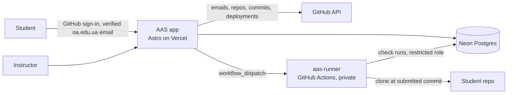

# AAS-T: Automated Assessment System — Tests

**Status:** MVP plan, 2026-10-02. The complete system is described in
[README.md](README.md). This file covers only what ships first; everything
else comes after the MVP (§11).

- **Deadline:** two weeks and a few days, around 19–21 October 2026.
- **Scale:** 1–3 streams of 10–15 students; 20–50 students per semester.
- **Hosting:** Vercel Hobby (non-commercial project), Neon Postgres, GitHub
  Actions.
- **Sign-in:** GitHub only, for accounts with a verified `@oa.edu.ua` email.
- **Kinds:** each test is either a control work or a quiz, never both.
- **Attempts:** one per test, for control works and quizzes alike.
- **Marks:** tests get the basic mark only, with no bonus. A test that wasn't
  submitted gets 0.
- **Variants:** one shared variant for all streams.
- **Retention:** one year.

## 1. Product Vision Board

**Vision:** practical web skills assessed fairly, quickly and transparently,
so the instructor spends time teaching instead of collecting links, and every
student knows what was graded and why.

| Target group | Needs | Product (MVP) | Business goals |
| --- | --- | --- | --- |
| **Primary:** the course instructor (Web Development 2026; React and Web A11y later).<br><br>**Secondary:** 20–50 students per semester, 3rd-year Computer Science, with their university email verified on GitHub. | **Instructor:** turn a Markdown handout into a test; set the criteria, the max mark and the grading; see who has submitted while the test runs; grade a stream in minutes; trust that the graded commit is the student's own.<br><br>**Students:** one clear attempt with no surprises; proof that the submission counts; results with reasons. | Web app on Vercel with GitHub sign-in, limited to verified `@oa.edu.ua` emails.<br><br>**Instructor:** tests from `.md`, criteria, grading scheme with an editable max mark, windows per stream, live board, review, publish, CSV export.<br><br>**Student:** one-attempt control-work submission with validation and a receipt; results page.<br><br>**Checks:** `courtly-check.ts` ported to Playwright, run in GitHub Actions on the submitted commit. | Less grading time per control work.<br><br>Every mark traceable to a commit, a check run and any overrides.<br><br>Integrity: verified identity, server-side deadlines, one attempt.<br><br>$0 running cost.<br><br>Reuse later for labs and other courses. |

## 2. MVP scope

| Area | P0: must ship | P1: if time allows | Later (§11) |
| --- | --- | --- | --- |
| Identity | GitHub sign-in with the `@oa.edu.ua` check; roster CSV; instructor list | — | Google sign-in as an option |
| Authoring | Upload `.md`, preview, criteria from `## Критерії`, points and auto/manual per criterion, grading scheme, windows per stream, publish | Editing the task text in the app | AI-drafted criteria; variants per stream |
| Control work | One-attempt submission, validation, receipt | — | Full report before the close |
| Quiz | — | Single and multiple choice, short answer, timer, shuffle, one attempt | Open answers, question pools |
| During the test | Live board, scheduled and manual close, extend, reopen for one student | — | Email notifications |
| Checks | `courtly-check.ts` ported to Playwright, run in GitHub Actions; Lighthouse through PageSpeed Insights, with a hand tick in review as the fallback, as today | Screenshots per width; a Lighthouse screenshot field in the submission form | Local Lighthouse; axe-core; a check library for other labs; build step for React |
| Review | Results page, manual criteria, override with reason, publish, CSV export | — | AI-suggested marks for open answers; bonuses (labs) |
| Ops | Production and dev databases, nightly backup | Preview deployments with sign-in | Retention clean-up job |

Each test is one kind, set by the `kind` field of its file. Control works come
first: they reuse the existing checker, and real Lab 7 submissions can test
them (§6). Quizzes need no runner and follow as soon as
the control-work flow is done.

## 3. How it works

### 3.1 Sign-in and roles

- **GitHub is the only sign-in.** Google sign-in would need a Google Cloud
  project to register its OAuth client. GitHub doesn't, and students need
  GitHub for their work anyway.
- **Domain restriction:** at sign-in the server reads the account's emails
  (GitHub API `GET /user/emails`, scope `user:email`). It admits the account
  only if one of them ends in `@oa.edu.ua` and is verified. GitHub verifies an
  address by sending a link to that mailbox, so this proves the student
  controls their university email.
- **Roster:** the instructor imports a CSV per stream (email, name, group). A
  verified university account that isn't on a roster sees "not enrolled".
- **Instructor:** listed by email in `INSTRUCTOR_EMAILS`.
- **Repository ownership** follows from sign-in: a submitted repository must
  belong to the signed-in GitHub account.
- **Onboarding:** current students already have their `@oa.edu.ua` address
  verified on GitHub (confirmed 2026-10-02). New students add it under GitHub
  → Settings → Emails. It doesn't have to be the primary address.

### 3.2 Instructor: creating a test

1. **Upload a `.md` file** in the course site's format (§4.1). Its `kind`
   makes the test a control work or a quiz. The app shows a preview, and
   site-relative links resolve against the course site.
2. **Criteria** come from the `## Критерії` checklist, or from an
   `acceptance:` list in frontmatter. The instructor can edit them.
3. **For each criterion:** its points, and whether it's evaluated `auto`
   (checks from the module; Lab 7's mapping is prefilled, §5) or `manual`.
4. **Grading scheme** (§4.3): **max mark (editable)**, min mark, mapping from
   points to a mark, and rounding. Tests use the basic mark with no bonus.
   Until results are published, changing the scheme recalculates the
   suggested marks.
5. **Windows per stream:** opening and closing times, the same day at
   different times. Shown in Europe/Kyiv; the server's clock decides.
6. **Publish:** students see the test in their list, and the task from the
   opening time.

### 3.3 Student: control work, one attempt

1. Before the opening time, the test is listed with its window and the task is
   hidden.
2. The task page and the submission form both warn:
   > **Одна спроба.** Після успішного подання змінити посилання не можна.
   > Оцінюється коміт, зафіксований у момент подання.
3. The student enters the repository URL and the published URL (GitHub Pages
   or Vercel), confirms in a dialog ("Я розумію, що спроба одна"), and
   submits.
4. **The server validates the submission in seconds:**
   - HTTPS, and allowed hosts only: `github.com`, `*.github.io`, `*.vercel.app`;
   - the repository exists, is public and belongs to the signed-in account;
   - the head commit of the default branch is recorded;
   - a GitHub Pages URL matches the account and repository; a Vercel URL is
     among the repository's deployments, or its HTML matches the repository;
   - the page returns HTML and passes the module's "right page" test (Lab 7:
     `#venues` or two venue names, as the checker does today).
5. **If validation fails, the attempt isn't used.** The student sees what to
   fix and submits again. The live board shows the failed tries (§3.5).
6. **If validation passes, the attempt is used.** The student gets a receipt,
   which stays on the test page:
   > Роботу подано 20.10.2026 о 14:32. Коміт `a1b2c3d` ·
   > https://student.github.io/courtly/. Зміни після цього моменту не
   > оцінюються.
7. **A wrong link after a successful submission** can only be fixed by the
   instructor reopening the attempt (§3.5).

### 3.4 Student: quiz, one attempt (P1)

1. Before starting, the student sees: "Одна спроба, 20 хвилин. Таймер не
   зупиняється."
2. **Start uses the attempt.** The server records the start; the attempt ends
   at `min(start + time limit, close)`.
3. **During the quiz:** questions arrive shuffled, and the answer keys never
   leave the server. Answers autosave, and reconnecting resumes the same
   attempt while time remains.
4. **On submit or timeout** the server grades the attempt. The result appears
   after publishing.

### 3.5 During the test: live board and closing

While a test is open, the instructor needs to see who has submitted and who
is still working, so nobody is closed out mid-work.

**Live board**, one per stream, refreshing every 15 seconds:

```text
Проміжний контроль №1 · КН-31 · closes 11:30 (in 18 min)
Submitted 11/14 · working 2 · validation failed 1 · not opened 0

Student             Status                Since   Details
Іваненко Олена      ✓ submitted           10:52   a1b2c3d · olena.github.io/courtly
Петренко Андрій     … working             10:05   opened the task
Коваль Марія        ✗ validation failed   11:08   repository is private (2 tries)
```

**Statuses:**
- **Control work:** not opened → working (opened the task) → validation failed
  (number of tries and the last reason) → submitted (time and commit).
- **Quiz:** not started → in progress (time left) → submitted or timed out.

**Closing:**

- **Scheduled close** is the default. Students see a countdown. At the closing
  time the server stops accepting submissions and ends quiz attempts with
  their saved answers.
- **Manual close** before that time asks for confirmation. The dialog lists
  everyone still working or stuck on validation, and its default button is
  "Keep open".
- **Extend** moves the closing time for a stream. **Reopen** gives one student
  a new attempt until a given time. Both need a reason, such as illness or a
  wrong link.
- **After the close**, students with no submission get 0, shown as
  "не подано · 0". A reopen before publishing covers cases like illness.

### 3.6 Grading and review

1. **Run checks.** After the close, the instructor presses Run checks, which
   starts the runner for the stream (§8).
2. **The runner checks each submission:**
   - clones the repository at the submitted commit and serves it locally;
   - runs the Courtly module in Playwright at 320 / 375 / 768 / 1440 px;
   - compares checks that depend on the real address (canonical, absolute
     `og:image`, `sitemap.xml`) against the submitted URL;
   - gets Lighthouse scores for the live URL from PageSpeed Insights (§5).
     Rows it can't score wait for the instructor's tick in review;
   - notes whether the live site still matches the commit.
3. **Review** is one table per stream with the suggested mark, the auto
   criteria, the manual criteria to fill in, and an override with a reason.
   Every change is a new entry, never an edit.
4. **Publish** releases a stream's results. **Export** writes a CSV, which is
   the gradebook.

### 3.7 Results and report

The MVP has one simple page per student, server-rendered, with no charts or
PDF:

```text
Проміжний контроль №1 · Courtly                          Оцінка: 10 / 12
Подано 20.10.2026 14:32 · коміт a1b2c3d · olena.github.io/courtly

Критерій                                                Бали    Коментар
✓ Немає горизонтального scroll, зокрема на 320 px       3 / 3
◐ Meta, canonical, Open Graph з абсолютним og:image     2 / 4   og:image — відносна адреса
✗ Mobile menu працює з клавіатури                       0 / 2   aria-expanded не змінюється
✓ Сторінка відповідає макету (перевіряє викладач)       4 / 4
  …
Коментар викладача: …
```

- **One row per criterion:** status (✓ full, ◐ partial, ✗ none), points earned
  out of points available, and the reason taken from the failed checks.
- **The instructor's version** of the page adds the check-level details under
  each criterion (grouped as in the Lab 7 report), the override history and
  the raw check run.

## 4. Formats

### 4.1 Task file

The course site's frontmatter stays as it is. An optional `assessment:` block
prefills the forms; after import, the app is the source of truth. The site's
content schema ignores unknown keys, so the same file still builds the
handout. Dates are set in the app, so the public repository never shows when
a test runs.

```yaml
---
number: 7
title: "Проміжний контроль №1: адаптивна landing page Courtly"
format: "Проміжний контроль"
assessment:            # optional; prefills the forms
  kind: control        # control | quiz
  checks: courtly@1    # check module and version
  maxMark: 12
---
```

### 4.2 Quiz file (P1)

```md
---
kind: quiz
title: "Тест 1: семантика і доступність"
timeLimit: 20   # minutes
maxMark: 12
---

## Який елемент позначає основний вміст сторінки?

- [ ] `<section>`
- [x] `<main>`
- [ ] `<div role="region">`

## Які атрибути `` потрібні для доступності та стабільного layout? {2}

- [x] `alt`
- [x] `width` і `height`
- [ ] `title`

## Яке значення `display` створює grid-контейнер?

= grid | inline-grid
```

- **Single choice:** exactly one `[x]`.
- **Multiple choice:** several `[x]`, graded all-or-nothing.
- **Short answer:** `= a | b`, matched case-insensitively against any listed
  answer.
- **Points:** `{n}` after a question; the default is 1.
- **Answer keys:** quiz files contain them, so upload them to the app only and
  never commit them.

### 4.3 Grading scheme

```ts
interface GradingScheme {
  maxMark: number;  // set in the instructor view, e.g. 12
  minMark: number;  // floor for a submitted work, e.g. 1
  map: 'linear' | { bands: { minPercent: number; mark: number }[] };
  round: 'nearest' | 'down' | 'up';
  bonusMax: number; // labs only, after the MVP; always 0 for tests
}
```

The scheme keeps a bonus field so labs can use it later (date bonuses, class
work). Tests always get the basic mark: the instructor view hides the field
for them.

The mark is computed in four steps:

1. **Criterion points.** An auto criterion earns its points times the weighted
   share of its checks that pass: `pass` counts in full, `warn` counts half,
   and `skip` drops out. A manual criterion gets what the instructor enters.
2. **Percent:** points earned divided by points available.
3. **Base mark:** `linear` gives `percent × maxMark`; `bands` gives the mark of
   the highest band reached. The result is rounded, then raised to at least
   `minMark`.
4. **Final mark:** for tests, the base mark. Labs will add their bonus here,
   capped at `maxMark`. An override replaces the final mark and needs a
   reason.

**Example:** 41.5 of 48 points is 86.5%. 86.5% × 12 = 10.38, which rounds
(`nearest`) to a final mark of 10.

Lab 7's checker works the same way today, with `linear`, `nearest`, a min of
1 and a max of 12. `minMark` applies only to submitted work. A test that
wasn't submitted ("не подано") gets 0.

## 5. Engine: porting `courtly-check.ts`

- **The original stays put.** `src/scripts/courtly-check.ts` and
  `/labs/lab-7/check/` remain in the course site unchanged, as the source and
  example and as the instructor's quick check of any URL.
- **The MVP ports it rather than rewriting it.** The Courtly module in the app
  repository keeps the same check ids, titles, weights and statuses. Only the
  plumbing changes:
  - fetch with CORS becomes files served from the clone on localhost;
  - `srcdoc` iframes at four widths become Playwright pages at each viewport
    width;
  - the sandboxed menu probe with `postMessage` becomes Playwright clicking the
    toggle;
  - Lighthouse works as it does in the checker since #12. The scored rows
    (Accessibility, Best Practices, SEO; 3 points each) come from PageSpeed
    Insights. Any row PageSpeed Insights can't score gets a «Виконано» tick
    in review, which counts as passed.
  - PageSpeed Insights runs against the live URL with the runner's own API
    key, because the course site's key only works from its own domain. This
    is the one part not graded from the commit; the runner runs right after
    the close and flags a live site that no longer matches the commit.
  - Local Lighthouse comes after the MVP.
- **Default criteria mapping.** The module maps its checks to Lab 7's 17
  criteria. Each auto criterion's points default to the sum of its checks'
  weights, so the auto part reproduces `courtly-check.ts`'s own mark.
- **Generalization waits.** Splitting the code into an engine and a check
  library (README §6) happens when a second assignment needs it.

## 6. Testing the MVP with Lab 7

There are two data sets. Both stay out of the public app repository.

1. **Fixtures:** the reference solution (`docs/lab-7/mockup/`, local only)
   and broken copies of it, stored in the private runner repository. The
   reference must score 12/12, and each broken copy must fail the checks it
   targets.
2. **Real submissions:** the Lab 7 links students sent by email.
   - Put them in a CSV with email, name, group, repository URL, site URL and
     the mark the checker gave.
   - An import script (`npm run import:submissions`) loads them into the
     **dev** database as roster entries and submissions. The commit SHA is
     the head at import time, since email didn't record one.
   - Run checks, then compare:
     - **Mark parity:** for every submission, the runner's mark equals the
       stored checker mark.
     - **Where marks differ:** re-run `/labs/lab-7/check/?url=…` today. If it
       now agrees with the runner, the site changed after grading. If it
       doesn't, compare the two reports check by check to find the porting
       bug. The Lighthouse rows can also differ: a stored mark may include
       rows ticked by hand from the student's screenshot, and a row near the
       90 threshold can flip between PageSpeed Insights runs.
     - **Robustness:** private repositories, dead links, Vercel URLs and wrong
       pages produce clear validation errors, not crashes.

The stored marks came from the checker, so this proves the port, not the
grading itself. That gets measured after the first real test, as the share of
marks the instructor overrides in review.

This tests grading on real work before any student uses the app. After that,
a dry run of the student flow (sign-in, one attempt, live board, closing)
needs only a few volunteers.

The CSV and the dev database hold real student data. Never commit them.

## 7. Tools

| Area | Tool | Why |
| --- | --- | --- |
| Language | TypeScript, strict | App, module and runner share types |
| Repositories | `aas` (public): npm workspaces `apps/web`, `packages/db`, `modules/courtly`. `aas-runner` (private): workflow, fixtures, backups | Public app repository because of Vercel Hobby (§8); private runner so logs and fixtures stay hidden |
| Web framework | Astro 7 with `@astrojs/vercel`; React islands for the criteria editor, live board and quiz player | Same framework as the course site; React only where screens hold state |
| Styling | Tailwind CSS v4 with the course tokens | The app looks like part of the course |
| Validation | Zod | One schema each for frontmatter, criteria, grading schemes and forms |
| Markdown | unified: `remark-gfm`, `remark-frontmatter`, `rehype-sanitize` | GFM task lists carry criteria and quiz answers; uploads become HTML, so they are sanitized |
| Database | Neon Postgres | Free plan, far beyond 50 students' needs |
| ORM | Drizzle ORM, drizzle-kit | The team knows it (see below) |
| Auth | Better Auth with the GitHub provider and a custom email check; sessions in Postgres | Drizzle adapter; the `@oa.edu.ua` rule lives in one hook |
| GitHub API | Octokit | Emails, repositories, commits, deployments, starting the runner |
| HTML on the server | linkedom | Validation reads the student's page without a browser |
| Checks | Playwright; PageSpeed Insights API | Runs the ported Courtly module; Lighthouse as the checker gets it today |
| Tests | Vitest, Playwright Test | Parsers, scoring and the attempt rule as unit tests; flows end to end |
| Quality | ESLint, Prettier, `astro check` | The toolchain Lab 1 teaches |
| Development | Claude Code (Pro), rules in `AGENTS.md` | Tool-neutral rules for teammates on other agents |

**Drizzle or something else?** Keep Drizzle.

| Option | For | Against |
| --- | --- | --- |
| **Drizzle ORM + drizzle-kit** | The team knows it; the schema in TypeScript gives types without a generate step; SQL-shaped queries; Neon serverless driver; Better Auth adapter; Drizzle Studio for browsing data | Nothing that matters at this size |
| Prisma ORM | Mature migrations, Prisma Studio, a readable schema language; recent versions dropped the Rust engine | A second schema language and a generate step; learning it costs MVP days |
| Kysely | A very light, type-safe SQL query builder | No schema-first models; migrations are written by hand |
| Plain SQL (Neon driver) | No dependency | No types or migrations without extra tools |

Drizzle is the best fit, and with a deadline of two and a half weeks,
familiarity counts most.

## 8. Hosting and DevOps



- **Vercel Hobby, non-commercial.** On Hobby, Vercel blocks deployments of
  commits by anyone except the account owner in a private repository. The `aas`
  repository is therefore **public**, which lets Anastasiia deploy. Nothing
  secret goes into it: rosters, submissions and results live in the
  database, and secrets live in Vercel's environment variables.
- **Runner in the private `aas-runner` repository.** Actions logs in a public
  repository are public and would show student repositories and results. The
  2,000 free minutes a month are plenty: a stream of 15 at about a minute each
  uses about 15.
- **How "Run checks" works:**
  - The app calls `workflow_dispatch` with a fine-grained token that has
    Actions write access on `aas-runner` only.
  - The job reads the stream's submissions and writes check runs through a
    Postgres role that can only read submissions and insert check runs.
  - The same script runs locally for debugging.
- **Neon:** a `main` branch for production and a `dev` branch for local work
  and the Lab 7 import.
- **GitHub OAuth apps:** one for production and one for `localhost`. Preview
  deployments run without sign-in until P1 adds Better Auth's OAuth proxy.
- **CI on pull requests:** lint, type check and Vitest in `aas`; engine
  fixtures in `aas-runner`.
- **Migrations:** drizzle-kit generates the SQL in the pull request, and the
  production build applies it.
- **Backups:** a nightly `pg_dump` from `aas-runner`, encrypted and kept as an
  artifact for 90 days. This must be in place before the first real test.
- **Secrets:**
  - in Vercel: `DATABASE_URL`, `BETTER_AUTH_SECRET`, `GITHUB_CLIENT_ID` and
    `GITHUB_CLIENT_SECRET`, `INSTRUCTOR_EMAILS`, `GITHUB_DISPATCH_TOKEN`;
  - in `aas-runner`: `RUNNER_DATABASE_URL` (the restricted role), `PSI_API_KEY`
    (the runner's own key, limited to the PageSpeed Insights API) and the
    backup encryption key.
- **Cost:** $0. Claude Code Pro is already paid and is used for development
  only.

## 9. Data and retention

| Table | Holds |
| --- | --- |
| `user`, `session`, `account` | Better Auth: GitHub account and the verified university email |
| `stream`, `enrollment` | Streams and their rosters |
| `test`, `test_window` | Task Markdown, criteria, grading scheme, check module; opening and closing times per stream |
| `task_view` | When each student first opened the task (for the live board) |
| `submission` | Every try, with `accepted` or `failed` and the reason. At most one accepted per student, unless a reopen allows another |
| `quiz_attempt` | P1: start, deadline, seed, answers, score |
| `check_run` | Results per check, module version, runner run id |
| `grade_event` | Append-only: criterion marks, overrides with reasons, publishing |
| `audit_log` | Sign-ins, uploads, closes, reopens, exports |

**Retention:** data is deleted one year after the test closes. The sign-in
page says so. The clean-up job isn't needed until October 2027.

## 10. Plan

Assuming work starts Monday 5 October, with the deadline on Wednesday
21 October:

| When | Build | Done when |
| --- | --- | --- |
| Week 1 (5–9 Oct) | Repositories, Vercel, Neon, OAuth apps; Drizzle schema; GitHub sign-in with the `@oa.edu.ua` check; roster import. Port `courtly-check.ts` with PageSpeed Insights; runner workflow; fixtures; import of the emailed Lab 7 links | Non-university accounts are rejected; the reference scores 12/12; real Lab 7 submissions get marks to compare with the checker's |
| Week 2 (12–16 Oct) | Authoring (upload, criteria, grading scheme with max mark, windows); one-attempt submission; live board, close, extend, reopen; review, publish, results page, CSV export | The team runs a full control work on the dev database, acting as students |
| Final days (19–21 Oct) | Quiz (P1) if on track; backups; fixes from a dry run with a few volunteer students | Mark parity (§6) holds; the dry run passes |

The engine comes first because it is the riskiest part, and the emailed Lab 7
links can test it from the middle of week 1.

**MVP success criteria:**

- every student signs in through a verified `@oa.edu.ua` account;
- no submission is lost, and none is accepted after the close or beyond the
  allowed attempts;
- every mark traces to its commit, check run and overrides;
- the runner reproduces the stored checker mark for every real Lab 7
  submission, or the difference is explained by a site change after grading.

## 11. After the MVP

From [README.md](README.md), roughly in this order:

- the quiz, if it slipped; then open answers and question pools;
- screenshots, if they slipped; local Lighthouse instead of PageSpeed
  Insights;
- variants per stream, against leaks between groups;
- labs on the same pipeline: self-check, date bonuses, the oral defense as a
  manual criterion;
- a check library and axe-core;
- AI assistance through the OpenAI account (criteria drafts, suggested marks
  for open answers);
- email notifications;
- the retention clean-up job;
- the React course (a build step in a sandboxed runner) and Web A11y.

## 12. Decisions

Recorded 2026-10-02, from the instructor's answers to the open questions:

- **Students' GitHub emails:** current students already have their
  `@oa.edu.ua` address verified on GitHub.
- **Test kinds:** one kind per test, never mixed. Control works come first;
  the quiz is P1.
- **Missing work:** a test that wasn't submitted gets 0.
- **Lab 7 marks:** all emailed submissions have marks from the checker. They
  are the reference for mark parity (§6).
- **Bonuses:** the grading scheme supports them for labs later. Tests get the
  basic mark only.

No questions are open.
